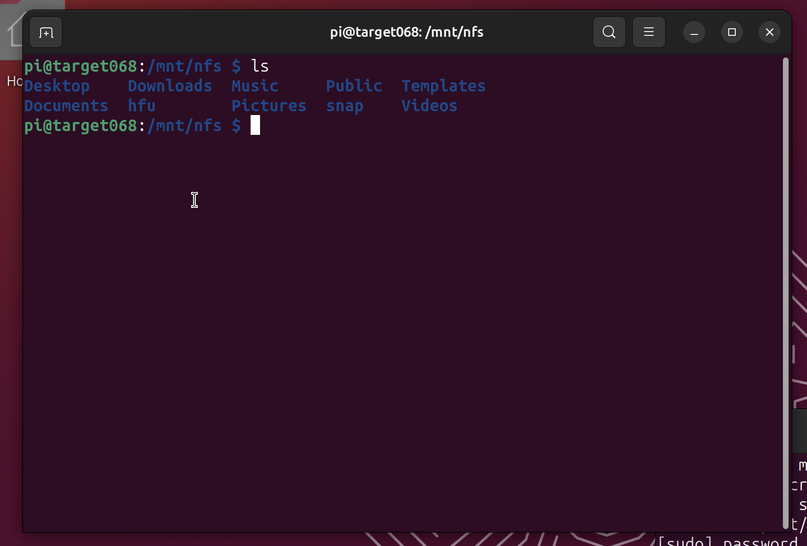
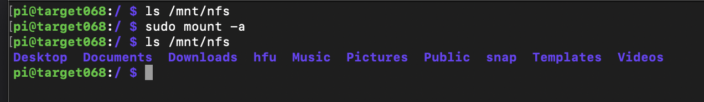

# Aufgabenblatt 02

Tim Zolleis

27068
 
#### 1.B
Es handelt sich um eine .img Datei (Dateiträgerabbild), auf welcher sich zwei "Partitionen" befinden: Eine Boot-Partition, sowie ein rootfs (EXT4)
#### 1.D
Auf der Karte befinden sich nun die selben zwei Partitionen wie auf dem Image
#### 2.B
Anlegen der Datei mit `touch ssh` in der Boot-Partition der Karte
#### 2.G
`tty` zeigt /dev/pts/0 - also die "SSH-Sitzung"
#### 3.C
Die Dateien des Home-Verzeichnisses des Hosts sind sichtbar

