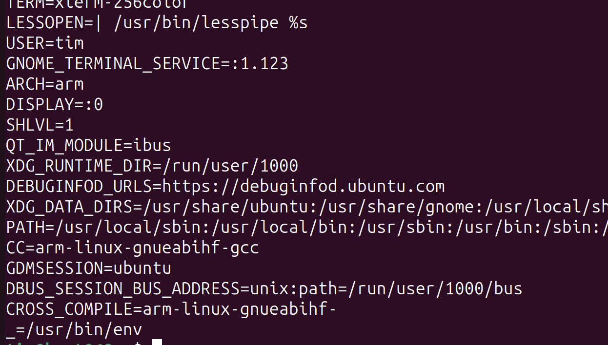
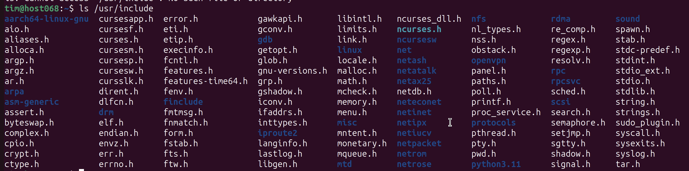
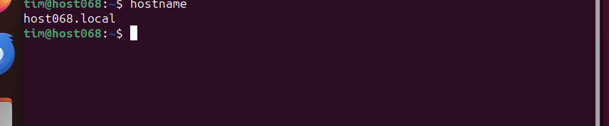

# Aufgabenblatt 01

Tim Zolleis

1d): TTY liefert die aktuelle Konsole (bei grafisch: `/dev/pts/0`), oder aber bei mehreren offenen Terminals die
jeweiligen Konsolen (`/dev/tty3/`, `/dev/tty4`)

1e): Der Host hat eine Adresse im 141.28.56.xx bereich (141.28.56.72) - am Adapter `enp0s1`

2b): Die Umgebungsvariablen können mit `env` ausgelesen werden:

Die Klammern bei CC referenzieren den Wert von `CROSS_COMPILE`, sodass bei Änderung dieser Variable sich die CC variable
mit ändert.

2c): Die `ncurses.h` Datei befindet sich im Verzeichnis `/usr/include/ncurses.h`:

3a): Die heruntergeladene Datei ist vom Typ `Zip archive data, at least v2.0 to extract, compression method=deflate`
und kann mit `unzip` entpackt werden.

3d): Der hostname wird in `/etc/hostname` und `/etc/hosts` geändert:

