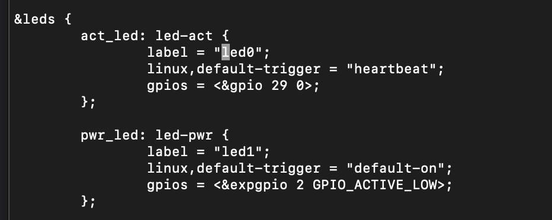
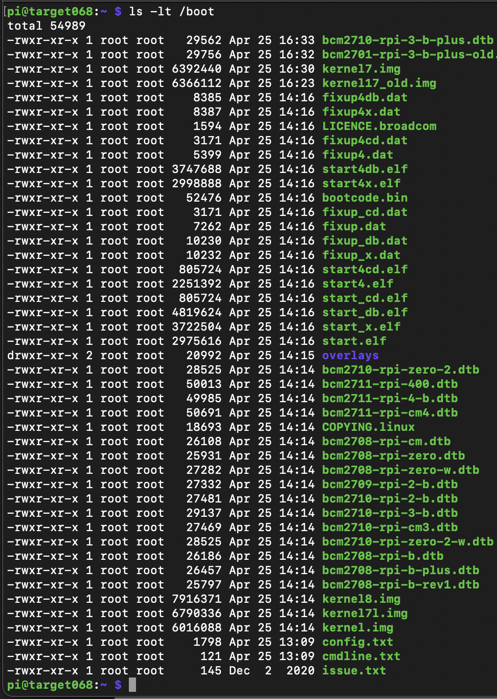

# Aufgabenblatt 04

**Tim Zolleis**

**27068**

### 2.a
Man findet die Datei mit `find . -name bcm2710-rpi-3-b.dts` - die richtige für den B+ ist die `./linux/arch/arm/boot/dts/bcm2710-rpi-3-b-plus.dts` (gefunden durch `find . -name bcm2710-rpi-3-b-*.dts` )

### 2.b

### 2.c
Leider ist mir die 1. Version diese Dokumentation durch einen Dateiverlust abhanden gekommen - somit weiß ich leider nicht mehr welches Paket gefehlt hat. Ich konnte mich nur noch dran erinnern, `gcc` nachinstalliert zu haben.

### 3.a
`Linux target068.local 5.10.103-v7+ #1529 SMP Tue Mar 8 12:21:37 GMT 2022 armv7l GNU/Linu`

### 3.b
Verschieben der Datei mit `sudo mv $KERNEL ${KERNEL}_old`

### 3.c
`Linux target068.local 5.10.63-v7+ #1 SMP Thu Apr 25 14:46:37 UTC 2024 armv7l GNU/Linux`

