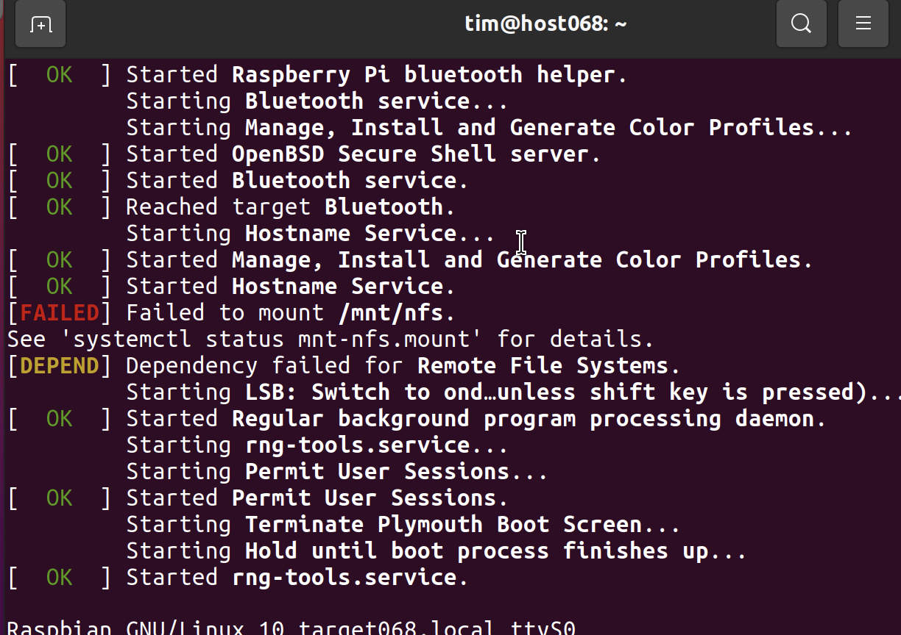
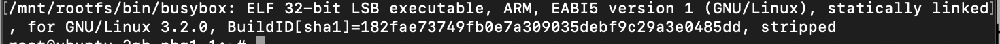
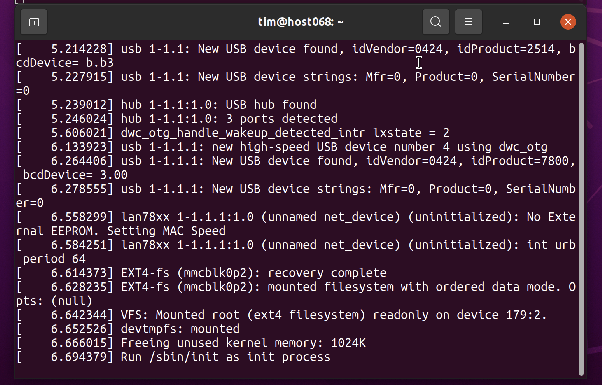
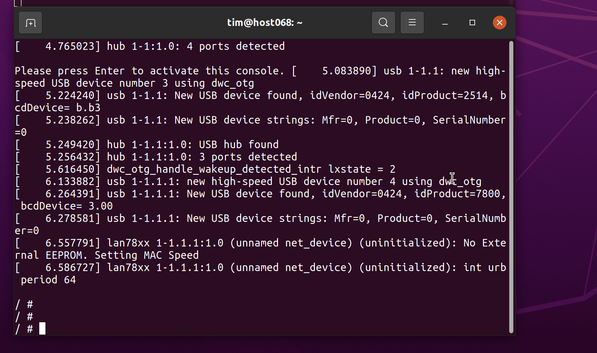
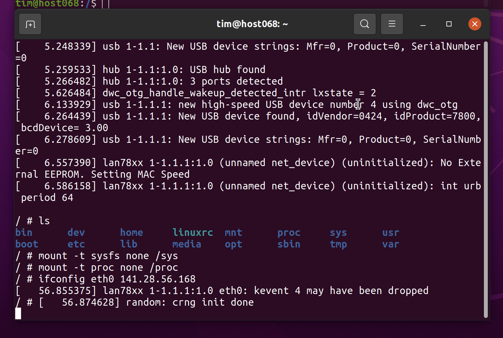
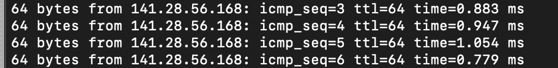

# Aufgabenblatt 05
**Tim Zolleis**
**276068**

### 2.b
Eingebunden unter `ttyUSB0`

### 2.d

Der Pi zeigt folgenden Knoten an: `Raspbian GNU/Linux 10 target068.local ttyS0` (also ttyS0)

### 2.e
IP-Adresse des Pis: `141.28.56.168`
### 3.e

### 5.a

### 5.b

### 5.g
Dieser Befehl (`mount -o remount,rw /dev/root /) muss auch in rcS eingetragen werden
### 
