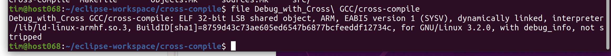
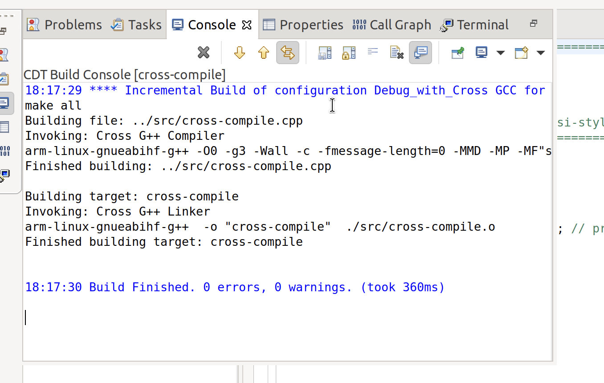
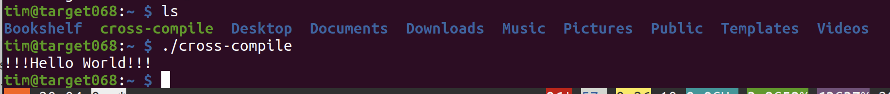
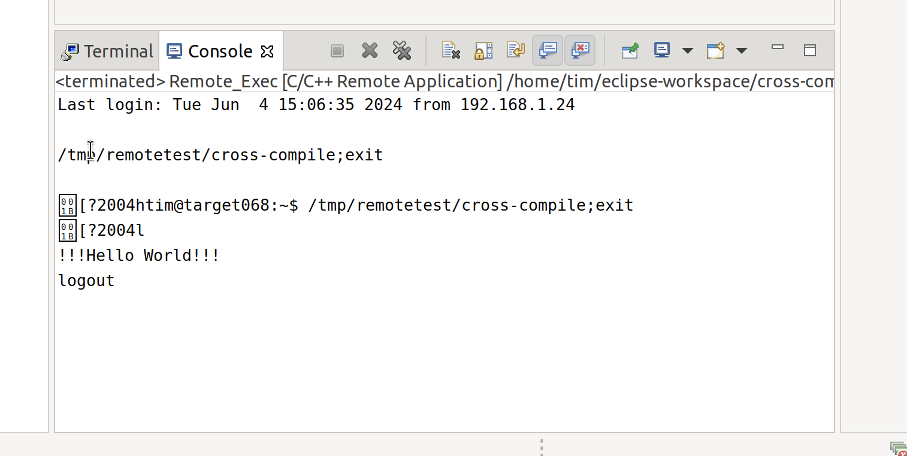
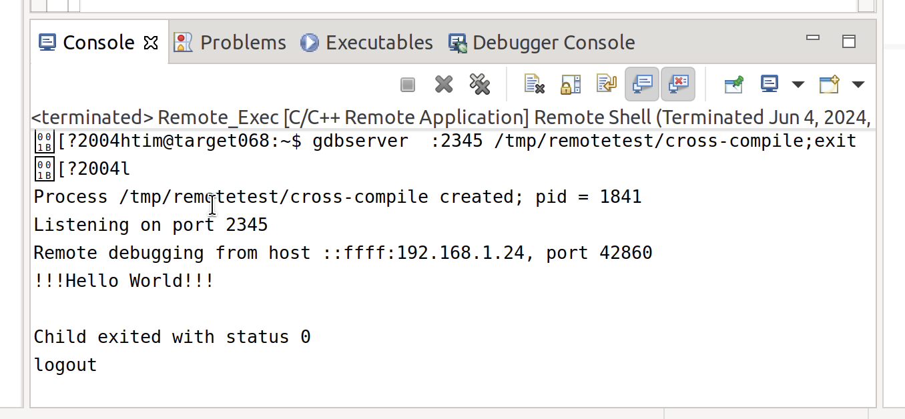
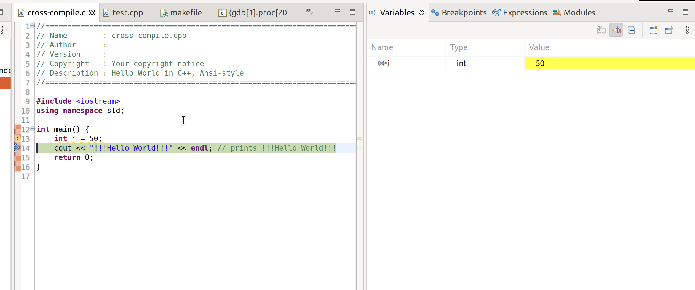

# Aufgabe 07
Tim Zolleis

1. Dateitypen des Cross-Compile
2. Ausgabe des Cross-Compile
3. Manuelles ausführen des Cross-Compiles
4. Ausgabe des Remote-Executes
5. Ausgabe des Remote-Debuggings
6. Breakpoint-Konfiguration und Ausgabe