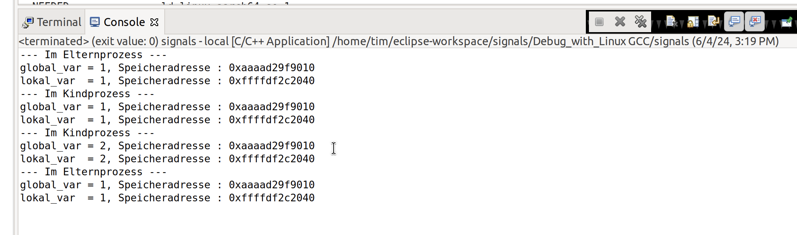
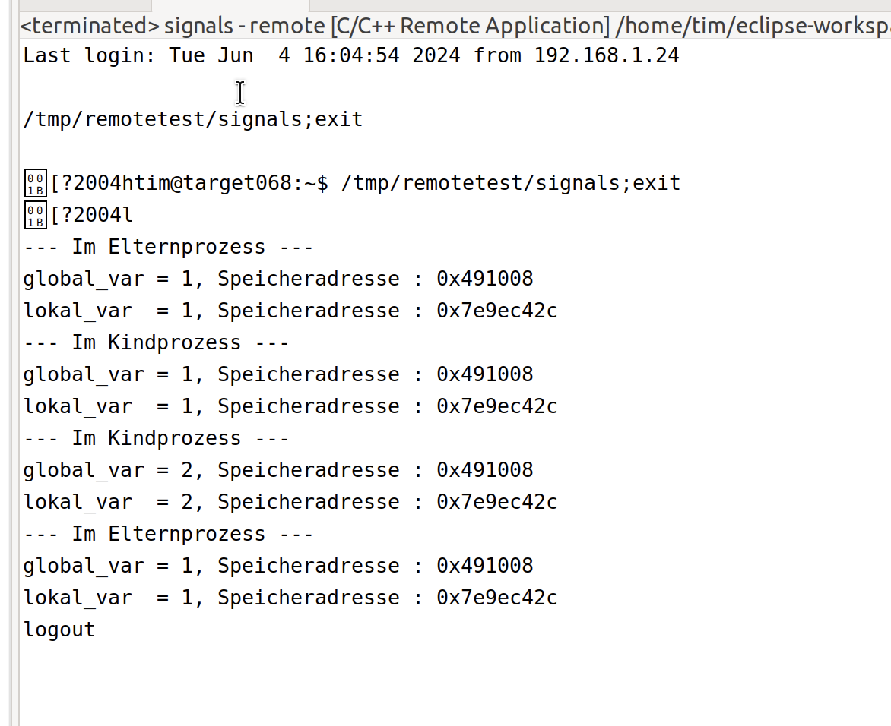
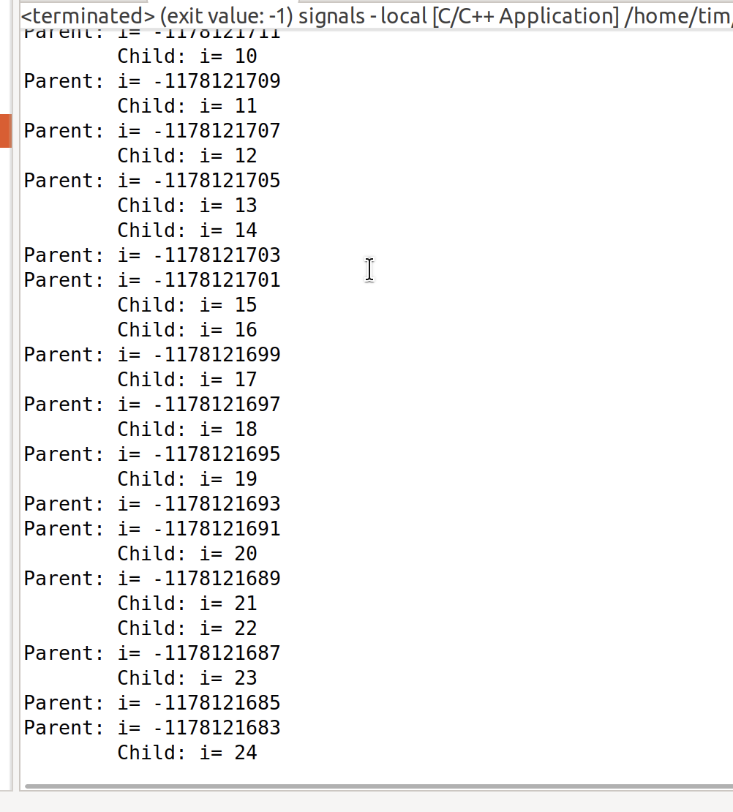
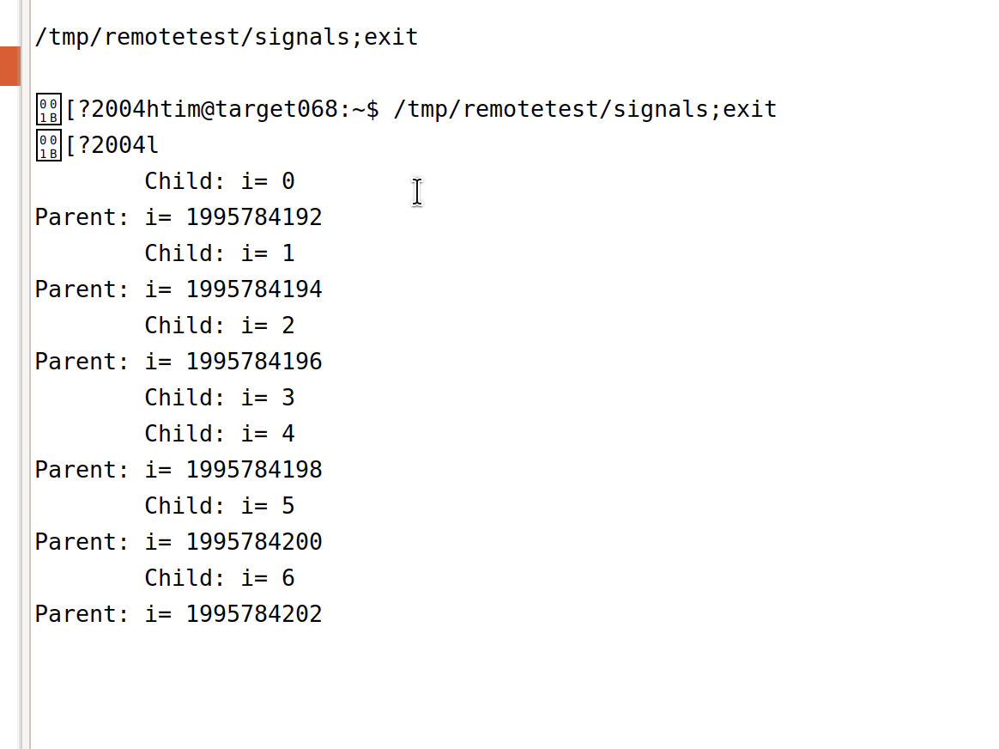
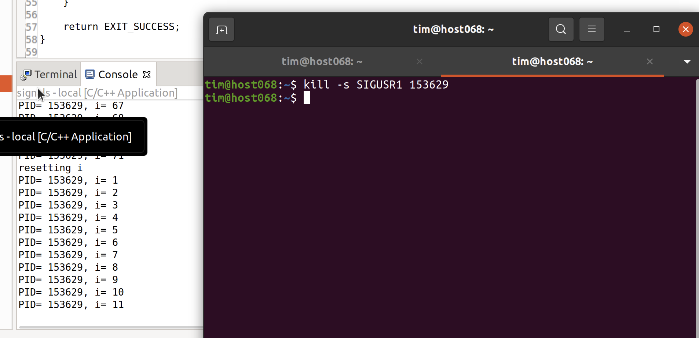
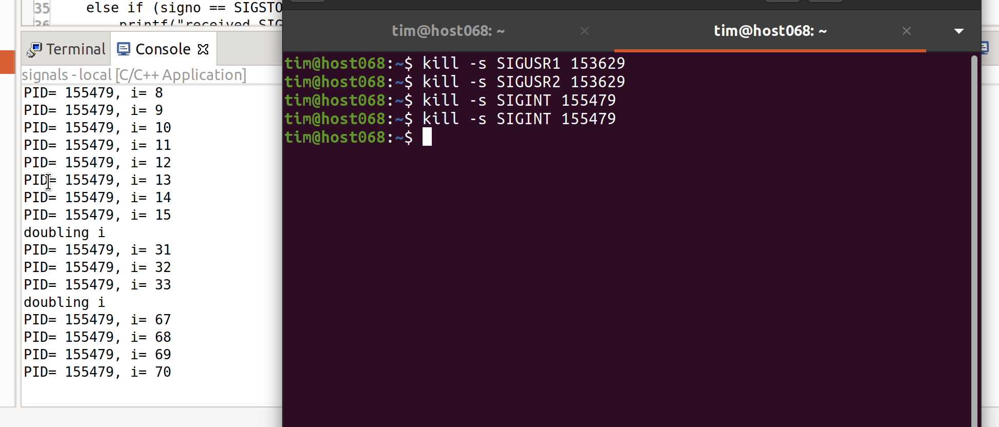
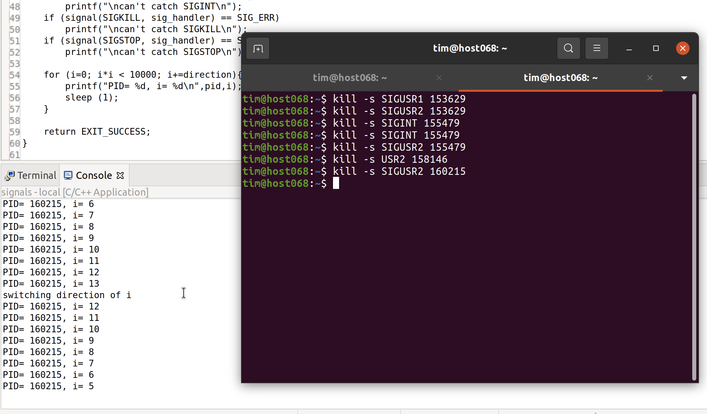
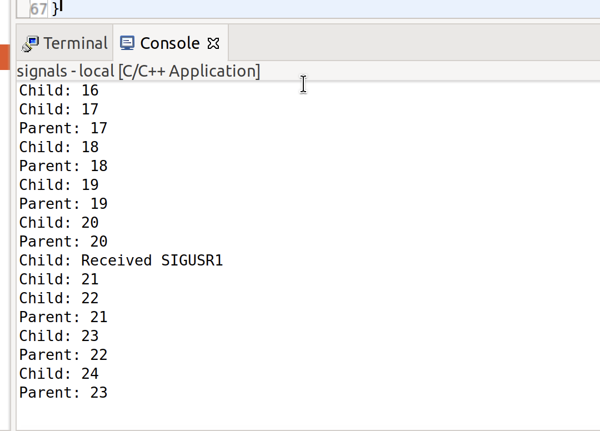
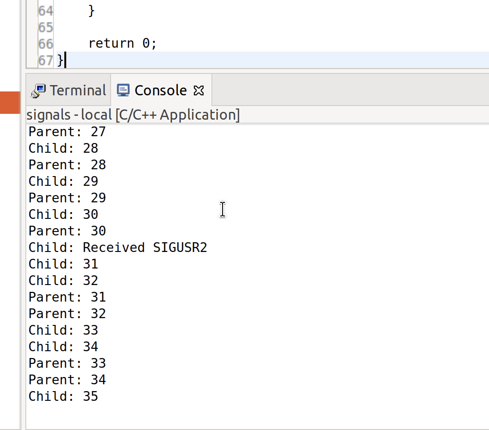
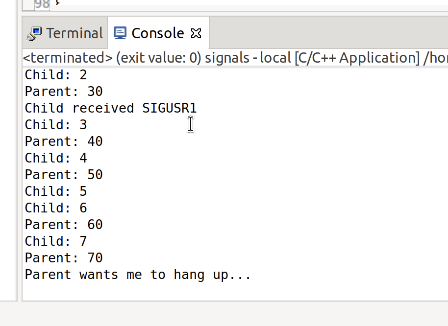

# Aufgabe 08
Tim Zolleis

## 1. Normaler Fork

## 2. Fork auf dem Target

## 3. For mit unterschiedlichen Laufvariablen
Dies kann durch Initialisieren der Variable (i = 0;) behoben werden - je nach Betriebssystem und Speicherplatz kann es zu unterschiedlichen Werten kommen.


## 4. Signale an Prozesse



## 5. Signale zwischen Parent und Child
```c
#include <unistd.h>
#include <sys/types.h>
#include <stdio.h>
#include <stdlib.h>
#include <signal.h>


void child_sig_handler(int signo){
    if (signo == SIGUSR1){
        printf("Child received SIGUSR1\n");
    }
    else if (signo == SIGUSR2){
        printf("Child received SIGUSR2\n");
    }
    else if (signo == SIGSTOP ) {
        printf("Child received SIGSTOP\n");
    }
    else if (signo == SIGCONT){
        printf("Child received SIGCONT\n");
    }
    else if (signo == SIGHUP){
        printf("Parent wants me to hang up...\n");
        exit(0);
    }


}

void runChild(){
    int count = 0;
    //Handlers
    signal(SIGUSR1, child_sig_handler);
    signal(SIGUSR2, child_sig_handler);
    signal(SIGSTOP, child_sig_handler);
    signal(SIGCONT, child_sig_handler);
    signal(SIGHUP, child_sig_handler);
    
    while(1){
        printf("Child: %d\n", count);
        count++;
        sleep(1);
    }
}

pid_t global_child_pid;
void parent_sig_handler(int signo){
    if(signo == SIGHUP){
        printf("Parent received SIGHUP\n");
        kill(global_child_pid, SIGSTOP);
    }
    else if(signo == SIGCONT){
        printf("Parent received SIGCONT\n");
        kill(global_child_pid, SIGCONT);
    }
}

    
void runParent(pid_t child_pid){
    global_child_pid = child_pid;
    //Handlers
    signal(SIGHUP, parent_sig_handler);
    signal(SIGCONT, parent_sig_handler);
    int count = 0;
    while(1){
        count+=10;
        printf("Parent: %d\n", count);
        
        if(count == 20){
            kill(child_pid, SIGUSR2);
        }
        if(count == 30){
            kill(child_pid, SIGUSR1);
        }
        if(count == 70){
            kill(child_pid, SIGHUP);
            break;
        }
        sleep(1);
    }
}

int main(void) {
	pid_t child_pid; 
	
	switch (child_pid = fork()) { 
	case -1:
		printf("Could not fork\n");
		break;
	case 0:
		runChild();
		break;
	default:
		sleep(1);
		runParent(child_pid);
		break;
	}
	return EXIT_SUCCESS;
}
```



